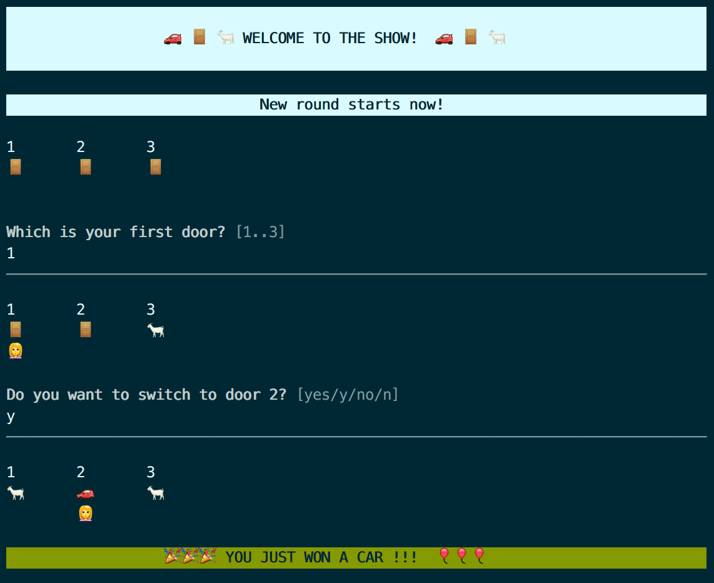

# node-monty-hall-problem




This little Node.js application brings the <a href="https://en.wikipedia.org/wiki/Monty_Hall_problem">Monty Hall problem</a> to your shell as an interactive game; retro swag is provided by emoji and ANSI colors. You can play as many rounds of the game as you like and check the statistics at any time.


## Installation

```
git clone https://github.com/stefan-girlich/node-monty-hall-problem
cd node-monty-hall-problem
npm install
```

## Usage
```
npm test	# execute all unit tests
npm start	# start the actual game
```

* Simply following the on-screen instructions.
* For each prompt, type one of the given options and confirm by pressing _Enter_.
* At any prompt, enter _?_ to view the current statistics.
* To leave the application, simply terminate is by pressing _Ctrl+C_ or _Cmd+C_.


## Configuration

The configuration can be changed in the file _config.json_. It contains the following top-level sections:

#### -
* **breakDuration**
How long should the game be paused between rounds? (seconds)


#### game
Configuration for the actual game logic.

* **doorCount**
How many doors should in the game? (min. 3)


#### symbols
Emoji to be used to represent game objects.

#### texts
On-screen texts.

#### allowedInput
Mapping of user input to multiple-choice answers in the command line prompt.


## Thanks

Thanks to Hsin Yu for inspiring me to write this little application :)